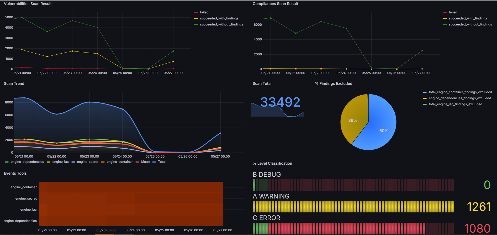

# DevSecOps Engine Tools

[](#)
[](https://github.com/bancolombia/devsecops-engine-tools/actions/workflows/build.yml)
[](https://sonarcloud.io/summary/new_code?id=bancolombia_devsecops-engine-tools)
[](https://sonarcloud.io/summary/new_code?id=bancolombia_devsecops-engine-tools)
[](#)

# Objective

Tool that unifies the evaluation of the different devsecops practices being agnostic to the devops platform, using both open source and market tools.

# Component

📦 [tools](https://github.com/bancolombia/devsecops-engine-tools/tree/trunk/tools): DevSecOps Practice Modules

# Communications channel

Here are the channels we use to communicate about the project:

**1. Mailing list:** You can join our mailing list to always be informed at the following link: [CommunityDevsecopsEngine](https://groups.google.com/g/CommunityDevsecopsEngine)

**2. Email:** You can write to us by email:  MaintainersDevsecopsEngine@googlegroups.com

# Getting started

### Requirements

- Python >= 3.8

### Installation

```bash
pip3 install devsecops-engine-tools
```

### Scan running - flags (CLI)

```bash
devsecops-engine-tools --platform_devops ["local","azure","github"] --remote_config_repo ["remote_config_repo"] --tool ["engine_iac", "engine_dast", "engine_secret", "engine_dependencies", "engine_container"] --folder_path ["Folder path scan engine_iac"] --platform ["k8s","cloudformation","docker", "openapi"] --use_secrets_manager ["false", "true"] --use_vulnerability_management ["false", "true"] --send_metrics ["false", "true"] --token_cmdb ["token_cmdb"] --token_vulnerability_management ["token_vulnerability_management"] --token_engine_container ["token_engine_container"] --token_engine_dependencies ["token_engine_dependencies"] 
```

### Structure Remote Config
[example_remote_config_local](https://github.com/bancolombia/devsecops-engine-tools/blob/trunk/example_remote_config_local/)
```bash
📦Remote_Config
   ┣ 📂engine_core
   ┃ ┗ 📜ConfigTool.json
   ┣ 📂engine_sast
   ┃ ┗ 📂engine_iac
   ┃   ┗ 📜ConfigTool.json
   ┃   ┗ 📜Exclusions.json
   ┃ ┗ 📂engine_secret
   ┃   ┗ 📜ConfigTool.json
   ┣ 📂engine_sca
   ┃ ┗ 📂engine_container
   ┃   ┗ 📜ConfigTool.json
   ┃   ┗ 📜Exclusions.json
   ┃ ┗ 📂engine_dependencies
   ┃   ┗ 📜ConfigTool.json
   ┃   ┗ 📜Exclusions.json
```

### Tools available for the modules (Configuration engine_core/ConfigTool.json)


<table>
  <tr>
    <th>Module</th>
    <th>Tool</th>
    <th>Type</th>
  </tr>
  <tr>
    <td rowspan="2">ENGINE_IAC</td>
    <td><a href="https://www.checkov.io/">CHECKOV</a></td>
    <td>Free</td>
  </tr>
  <tr>
    <td><a href="https://kubescape.io/">KUBESCAPE</a></td>
    <td>Free</td>
  </tr>
  <tr>
    <td>ENGINE_SECRET</td>
    <td><a href="https://trufflesecurity.com/trufflehog">TRUFFLEHOG</a></td>
    <td>Free</td>
  </tr>
  <tr>
    <td rowspan="2">ENGINE_CONTAINER</td>
    <td><a href="https://www.paloaltonetworks.com/prisma/cloud">PRISMA</a></td>
    <td>Paid</td>
  </tr>
  <tr>
    <td><a href="https://trivy.dev/">TRIVY</a></td>
    <td>Free</td>
  </tr>
  <tr>
    <td>ENGINE_DEPENDENCIES</td>
    <td><a href="https://jfrog.com/help/r/get-started-with-the-jfrog-platform/jfrog-xray">XRAY</a></td>
    <td>Paid</td>
  </tr>
</table>

### Scan running sample (CLI) - Local

> Complete the value in **.envdetlocal** file a set in execution environment
```
$ set -a
$ source .envdetlocal
$ set +a
```


```bash
devsecops-engine-tools --platform_devops local --remote_config_repo DevSecOps_Remote_Config --tool engine_iac

```
### Scan result sample (CLI)


# Metrics

With the flag **--send_metrics true** and the configuration of the AWS-METRICS_MANAGER driven adapter in ConfigTool.json of the engine_core the tool will send the report to bucket s3. In the [metrics](https://github.com/bancolombia/devsecops-engine-tools/blob/trunk/metrics/) folder you will find the base of the cloud formation template to deploy the infra and dashboard in grafana.



# How can I help?

Review the issues, we hear new ideas. Read more [Contributing](https://github.com/bancolombia/devsecops-engine-tools/blob/trunk/docs/CONTRIBUTING.md)